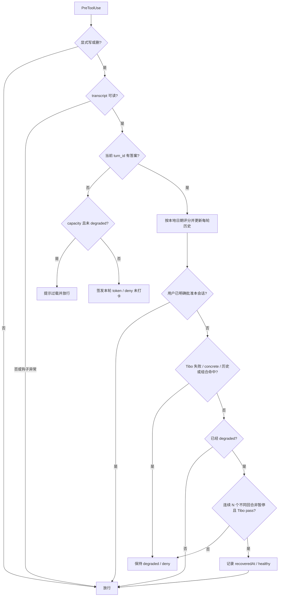

# Codex 降智检查插件设计

更新：2026-09-16，版本 0.2.2。历史动机见 `background.md`，旧 MVP 不代表当前评分契约。

身份优先判定：PERSON 与 WRONG_AFFILIATION 同时命中直接 fail，reason 为 `tibo_wrong_affiliation`；优先于正确公司、一般 tibo_fail 和 cutoff 信号。错误归属名单及安装校验命令见 README。严格关键词共现会误伤否定/对比语句，当前按用户要求保留此取舍。

## 目标与边界

在当前工作会话的显式写/删前执行本地自检；读/搜不打扰。热路径不启动模型、不联网查答案，目标 <50ms，宿主超时 5s。异常、超时、无法读取 transcript 一律 fail-open。暂停统一用 `permissionDecision: deny`；实测 `ask` 在 bypassPermissions 下会被忽略。

这不是安全沙箱，也不是可靠的模型鉴定器。自报信号可能被话术污染，健康模型也可能命中。保留用户明确批准和连续恢复路径。

## 结构

| 文件 | 职责 |
|---|---|
| `.codex-plugin/plugin.json`、`package.json` | 插件清单与同步版本 |
| `hooks/guard.cjs`、`.codex-plugin/plugin.json` | UserPromptSubmit、PreToolUse、Stop；当前发行版将 hook 清单内嵌在插件清单中 |
| `lib/tools.cjs` | 文件工具与 shell 命令分类 |
| `lib/score.cjs` | Tibo、cutoff、Juice 本地评分 |
| `lib/state.cjs` | 会话 token、回合答案、黏性状态、历史 |
| `lib/transcript.cjs`、`lib/parse.cjs` | 按回合读取备用答案 |
| `scripts/mcp-server.cjs`、`.mcp.json` | submit_check 与手动探针入口 |
| `lib/update.cjs` | 查版本，只通知不安装 |
| `probes/`、`skills/` | 手动体检，不在写前热路径运行 |

清单指向 `./skills/` 和 `./.mcp.json`；当前发行版把三个 hook 的命令对象直接写入 `.codex-plugin/plugin.json` 的 `hooks.hooks`。MCP cwd 必须为 `./`，不使用不被展开的 `${PLUGIN_ROOT}`。

## 写前流程

UserPromptSubmit 发新 token，MCP submit_check 记录答案；备用来源是当前回合的 transcript 工具调用和 DEGRADE_CHECK 正文行。注入只要求自述，不给预期身份、年份或推理容量答案，**不要求模型报当天日期**。grounding 必须自发提供。

## 命令分类

轻量 lexer 按未被引号包裹的 `;`、`|`、`&&`、换行等分段。引号内分隔符、路径和参数保留为 token 内容。命令词仅匹配分段首 token，git/npm 等子命令独立判断；不在整条命令上寻找裸词。命令位置的 `.exe` 可取执行文件 basename，普通参数路径不参与识别。

顺序：无任何重定向且全部分段为只读 → read；否则先 delete，再 write；未知 → other、mutating=false。文件输出重定向（含 `2>`）算 write；`2>&1` 仅复制描述符，不算文件写入。参数里的 `>` 不算重定向。

只读白名单含 Get-Content（含 -Raw）、Get-ChildItem、Test-Path、Select-Object、Select-String、Measure-Object、Sort-Object、Out-String、rg、grep、findstr、git status/diff/log/show/rev-parse、node/npm --version 等。混合命令 `Get-Content a.ts; Set-Content b.ts x` 不能因只读命令而放行。实测 `.patch.mjs` 文件名不再触发 patch 写规则。部分已知解释器的显式写删 API 另行识别。

**取舍：保留未知默认放行。本插件只覆盖显式写/删特征，不作为安全边界。** 不完整解释 shell、别名、动态拼接或任意 Python/JavaScript。它们可能漏报，npm test 等也可能写缓存。未知默认拦截会明显打断合法流程，本版选择在 README 明示限制；真正的权限边界由宿主沙箱提供。

## Cutoff 四档

`scoreCutoff(value, today)` 的 today 为钩子本地时区 `YYYY-MM-DD`，使用本地日历日期，不用 `toISOString()` 的 UTC 日期替代，避免与 Codex 注入 `<current_date>` 在午夜附近错位。跨时区上下文容差为 ±1 天。

1. 提取全部 YYYY-MM、YYYY/M、YYYY.M、YYYY年M月、YYYY-MM-DD、YYYY年日期形态，兼容中文年月日及单独年份。优先消费完整日期，避免重复命中年月。
2. 任一日期不是当天 ±1 天 → concrete。年月和年份没有日精度，无法等同今天；无效日历日期也不能作为 grounding。
3. 否则日期全部在容差内且含 REFUSE/HEDGE 语义 → grounded。
4. 日期在容差内但无拒绝/含糊语义 → concrete，即把今天当知识截止。
5. 无日期的拒答/含糊回答 → vague；其他无日期的非空文本也保守归 vague，不授予健康证据。
6. 空回答 → missing。

任何具体截止日期是本策略的降智证据；含糊 + 当天日期是 grounding 健康证据。grounded 不能抵消 Tibo fail，vague 不拦、不加分、不解封；两者都不作为旧组合规则的健康票。cutoff 任何档位都不能作为恢复分数。

以 today=2026-09-16、Tibo pass 为例：

| cutoff | kind | 默认暂停 |
|---|---|---|
| 2024-06 / 2024-12 / 2025-01 | concrete | 是 |
| 2026-09-16 | concrete | 是 |
| 我不确定，但今天是 2026-09-16 | grounded | 否 |
| refuse | vague | 否，仅无证据 |
| 空 | missing | 否 |

`MODEL_DEGRADATION_GUARD_CONCRETE_CUTOFF_MODE`：

| 值 | 行为 |
|---|---|
| pause（默认，非法值也退回此值） | concrete 独立暂停，reason=cutoff_concrete_date |
| flag | 记录 concrete，但不由新规则暂停，用于人工估计误报率 |
| off | 恢复 0.1.19 的 cutoff 分类及旧组合判定 |

各模式都保留 Tibo fail、不同回合累计两次未解决 Tibo、Tibo ambiguous + 旧截止金丝雀 + Juice 0/none 或历史矛盾等原规则。pause 的 reason 优先级为 Tibo fail、concrete、累计未解决、旧组合。flag/off 不等于关闭闸门。每条 checkHistory 均有 cutoffConcrete 布尔值，off 时 cutoffKind 是旧分类。detail 保留日期、今日、模式和签名。

新口径可能误伤如实报告知识截止日期的健康模型，不能作为路由鉴定真值。flag 应结合人工标签收集误报率，历史字段本身不提供真值。

## 回合绑定与恢复

状态保存于 `$CODEX_HOME/model-degradation-guard/<session_id>.json`，默认 `~/.codex`。保留 state version 1 和原字段，新增字段兼容读入，不清除旧 degraded。

Codex 提供 turn_id 时，答案必须同时满足 token、answers.turnId、check.turnId 与 PreToolUse turn_id 一致。MCP 按 token 找状态并复制其绑定 turnId；模型不能任意指定归属。子回合缺自己的答案时 deny(buildMissingCheckReason)，签发本回合 token。同一 session 的多个回合交错使 token 更新时，被替代回合需重新打卡，不能借用其他回合答案。

transcript 只取明确匹配 turn_id 或位于该回合起始标记后的记录；遇到另一回合起始标记立即停止把无标记记录归于前一回合。支持 MCP item、直接 JSON 工具调用、代码包装调用和正文行。Codex 未提供 turn_id 时不猜归属，但状态里按本轮 token 打卡的答案仍然认，避免打卡成功也读不回来把写/删永久拦住；不可读 transcript 属环境故障，仍放行。

| 状态 | 转移 |
|---|---|
| unknown / healthy | 本轮未打卡 deny；命中则 degraded |
| degraded | 单次非暂停不转 healthy；读搜仍放行 |
| degraded_approved | 明确用户批准后的会话评分豁免，每轮仍打卡 |
| overloaded | 仅提示过载；不能覆盖已有 degraded 或用户批准 |

recordCheck 按 turnId 去重，同轮重试不伪造历史矛盾或连续轮数。自动恢复要求连续 N 个不同回合均 pause=false 且 tibo=pass；默认 N=3，`MODEL_DEGRADATION_GUARD_RECOVERY_PASSES` 可设正整数，非法值回退 3。ambiguous、fail、暂停或缺打卡中断累计。同轮失败后重报 pass 不增加恢复轮数。

解封路径：用户明确回复经 approveSession 写 `approval={basis:'explicit_user_approval',reason,turnId,at}`；自动恢复写 `recoveredAt={reason:'consecutive_tibo_pass',required,turnIds,at}` 并转 healthy。自动恢复后再次命中会重新降级，用户批准持续豁免评分；都保留 usedDegraded。

Stop 仅在疑似降智后实际放行过写删时提醒；首次必提，默认每 5 个写入回合或间隔 30 分钟且有新写入再提醒。使用 Stop block + reason 要求转述，stop_hook_active 防环，提醒附解封依据与时间。未放行过写入不声称已经写了低质量代码。

## 验证与手动探针

npm test 覆盖原始 Windows 组合命令、混合写删、日期形态与多日期、pause/flag/off、恢复与中断、父子回合及 transcript 备用通道、异常 fail-open、deny 文案不泄题，以及既有探针/更新逻辑。

手动探针在空会话并关闭 memories：鹈鹕交由用户对比参考图，不自动定性；糖果固定 5 次、最多 2 路并发，正确至少 3 次为未见降智。不替代当前工作会话闸门。
