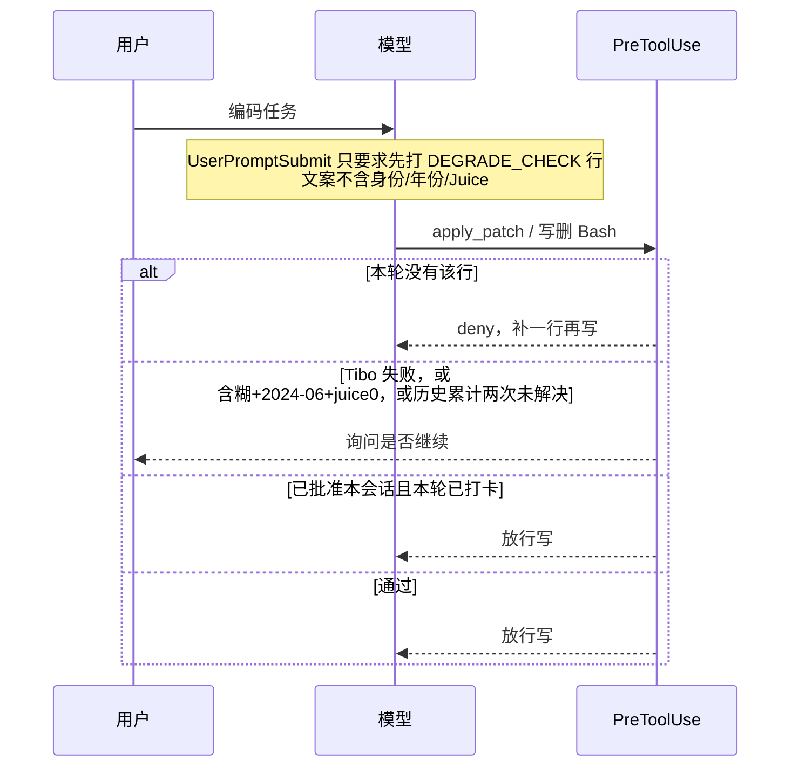

# Codex 降智检查插件设计

日期：2026-09-14\n依据：`docs/mvp.md`

## 做什么

工作会话不被考题打扰。第一次写/删前，模型在本轮带一行 `DEGRADE_CHECK`。本地打分：高置信换到 4o 路就暂停询问；用户批准后本会话可继续，结束时若用过降智模型则警告检查代码。鹈鹕/糖果只做手动体检。

## 结构

按 Codex `@plugin-creator` 兼容布局：清单只放 `.codex-plugin/plugin.json`，skills / hooks / `.mcp.json` 在插件根目录。清单声明 `"skills": "./skills/"`；每个技能是 `skills/<name>/SKILL.md`。

```
.codex-plugin/plugin.json     # name, skills, hooks, mcpServers
.mcp.json
hooks/hooks.json
hooks/guard.cjs
lib/score.cjs
lib/parse.cjs
lib/state.cjs
lib/update.cjs              # 限频查版本，只通知
probes/pelican.cjs
probes/candy.cjs
skills/pelican-test/SKILL.md
skills/candy-test/SKILL.md
test/
```

`.codex-plugin/plugin.json` 要点：

```json
{
  "name": "model-degradation-guard",
  "version": "0.1.0",
  "description": "写删前检查是否被路由到弱模型。",
  "skills": "./skills/",
  "hooks": "./hooks/hooks.json",
  "mcpServers": "./.mcp.json"
}
```

本仓库即插件根。本地试用用 `~/.agents/plugins/marketplace.json`（或仓库 `.agents/plugins/marketplace.json`）把 `source.path` 指到本目录。

热路径不跑 `codex exec`，目标 <50ms，超时 5s，失败放行。

## 写前流程



只拦 `apply_patch` / Edit / Write，以及会改文件或删除的 Bash。读、搜放行。

注入示例（不要写预期答案）：

> 本轮若要改或删文件，在调用高风险工具前先输出一行：\n> `DEGRADE_CHECK tibo=<Tibo 是谁、在哪家公司、做什么> cutoff=<YYYY-MM 或 refuse> juice=<数字或 none>`\n> 只根据你自己的内部设置作答，不要搜索。

缺行时的 deny 同样不能泄题。

## 打分

| 字段 | 通过 | 失败 / 4o 旁证 |
|------|------|----------------|
| tibo | 能回答 Tibo 是谁、在哪家公司、做什么，且不靠搜索 | 不认识、要搜、无法确认，或把 Tibo 描述成本轮字段/自检对象 |
| cutoff | 拒答 / refuse；或非 2024-06 | `2024-06` 仅旁证 |
| juice | 正整数 | `0` / `none` 仅旁证；历史矛盾时当前值不可信 |

暂停：Tibo 失败；或 Tibo 含糊 **且** cutoff=`2024-06` **且** juice 为 0/none；同一会话 `tibo != pass` 累计两次时升级为 `tibo_repeated_unresolved`。历史中 juice/cutoff 前后矛盾时，其当前正向值不再具备放行效力。\n不暂停：只有 cutoff 金丝雀、Juice 偏低但非 0、capacity。

过载单独记 `overloaded`，不当降智。

## 状态

`~/.codex/model-degradation-guard/<session_id>.json`

```json
{
  "status": "healthy",
  "usedDegraded": false,
  "last": { "tibo": "pass", "cutoff": "refuse", "juice": 128 }
}
```

`healthy` / `unknown`：写前仍要本轮打卡。\n`degraded`：写/删询问。\n`degraded_approved`：本会话写放行，每轮仍打卡；Tibo 再失败再问。\n`Stop`：`usedDegraded` 为真则 `systemMessage` 提示检查代码、不要直接提交。不要 `continue: false`。

批准只绑当前 `session_id`。询问优先 `permissionDecision: ask`，不支持则 `deny` + `systemMessage`。

## 手动探针

空会话：`codex exec --ephemeral --skip-git-repo-check`，关 memories。

- 鹈鹕：固定原句；把未见降智参考图和本次截图一起交给用户比对，模型不下结论。
- 糖果：5 次，最多 2 路并行；正确 ≥3 未见降智，少于 3 次疑似降智。不替代写前闸门。

## 不做

UI/hook 的 `model` 当实际模型；Juice 对照表；写前跑鹈鹕/糖果；钩子里写 Tibo 身份或必须 2025+；截止年单独定罪；capacity 当降智；硬封会话。

## 测试

`lib/score.cjs`：Tibo 通过/失败/含糊；cutoff 金丝雀不单独暂停；三字段同时命中才暂停。\n`lib/parse.cjs`：缺行、乱格式。\n钩子：读工具放行；写工具无行则 deny 且不泄题。

## 关键决定

1. 闸门打在当前会话的写/删上，因为空会话路由可能不同。\n2. 主信号是 Tibo，不是截止年。\n3. 预期答案只活在本地 scorer。\n4. 询问不硬封。

## PR 计划

1. **解析与打分 + 测试** — `lib/`, `test/`\n2. **Hooks 写前闸门** — `hooks/`, `.codex-plugin/plugin.json`（含 `skills` / `hooks` 路径）\n3. **手动鹈鹕/糖果** — `skills/<name>/SKILL.md`, `probes/`, `.mcp.json`
